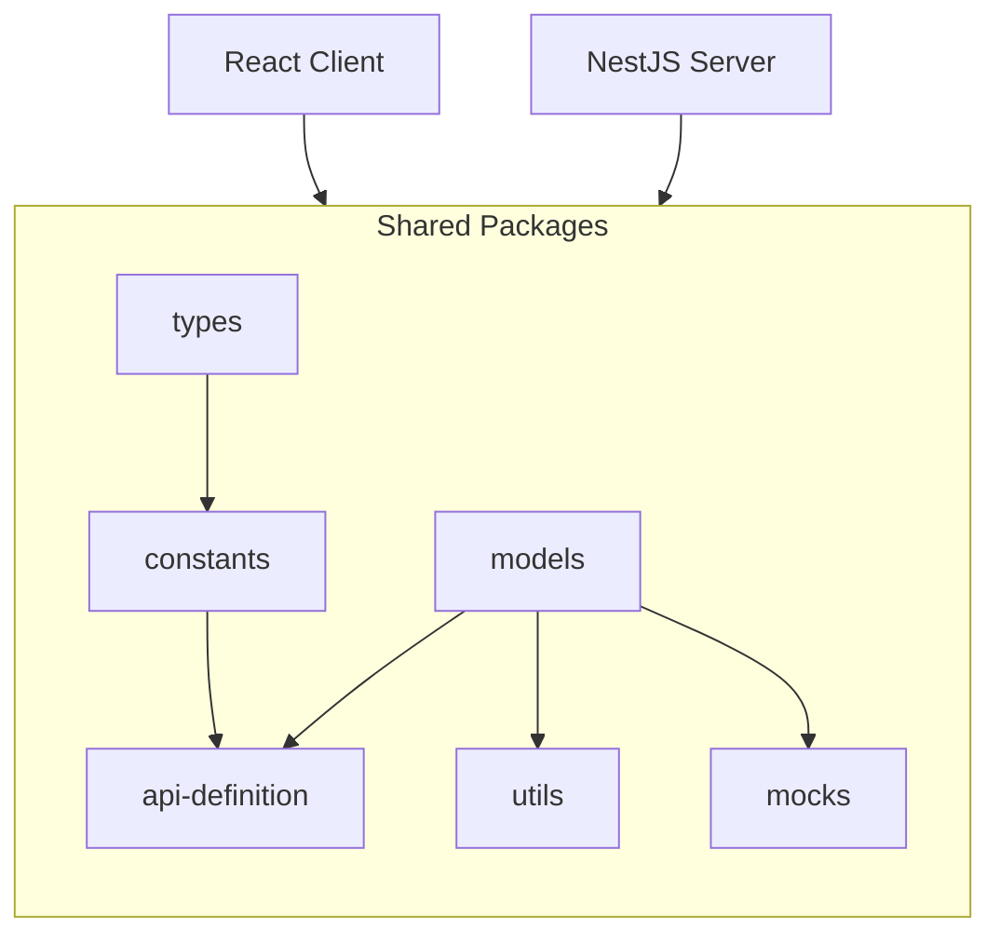

# 🏗️ Architecture Overview

## 🖼️ Diagram

## 📱 Client Application (React)

The **React Client** is the part that users interact with and contains all code exposed to the client.

### What it contains:
- **React Application**: Client application (web based)

## 🚀 Server Application (NestJS)

The **NestJS Server** is the part that runs on the server.

### What it contains:
- **Server Code**: Complete NestJS backend implementation
- **Database Schema**: ORM-based database schema and migrations

## 📦 Shared Packages

### 🔗 API definition
**Purpose**: Complete API contract definitions for all available endpoints

**What it contains**:
- **Route Definitions**: Every controller and endpoint specification
- **HTTP Methods**: GET, POST, PUT, DELETE, PATCH method definitions
- **DTOs (Data Transfer Objects)**:
  - Query parameters schemas
  - Route parameters schemas
  - Request body schemas
  - Response body schemas
- **TypeScript API Utils**: Code to interact with endpoints and controllers

**Benefits**:
- Contract-first API development
- Type-safe client-server communication
- Consistent endpoint definitions

### 🎯 Constants
**Purpose**: Shared constant values used across applications

**What it contains**:
- Application constants
- Default values and limits

**Benefits**:
- Single source of truth for constants
- Easy maintenance and updates
- Type-safe constant access

### 📋 Types
**Purpose**: Shared TypeScript type definitions and interfaces

**What it contains**:
- Common types

**Benefits**:
- Consistent typing across applications
- Reduced type duplication
- Better IDE support and autocomplete
- Compile-time type checking

### 🏗️ Models
**Purpose**: Zod validation schemas and their TypeScript equivalents for shared modules

**What it contains**:
- **Zod Schemas**: Runtime validation schemas for data structures
- **TypeScript Types**: Generated types from Zod schemas
- **Shared Modules**: Common data models used across applications
- **Validation Logic**: Input validation and transformation rules
- **Type Guards**: Runtime type checking utilities

**Benefits**:
- Runtime and compile-time validation
- Consistent data structures
- Type-safe data parsing
- Automatic type inference from schemas

### 🛠️ Utils
**Purpose**: Shared business logic and utility functions

**What it contains**:
- **Business Logic**: Reusable business rules and calculations
- **Data Transformation**: Formatting and conversion utilities
- **Common Algorithms**: Shared computational logic

**Benefits**:
- Code reuse across applications
- Consistent business logic implementation
- Tested and reliable utility functions
- Reduced bundle size through sharing

### 🎭 Mocks
**Purpose**: Shared mock data and implementations for testing

**What it contains**:
- **Test Data**: Mock objects and fixtures for testing
- **Database Seed Data**: Development and testing datasets
- **Test Helpers**: Testing utility functions and setup

**Benefits**:
- Consistent test data across applications
- Faster development with realistic mock data
- Reliable testing environments
- Easy integration and unit testing setup

## 🔄 Package Dependencies

### How Applications Use Packages:

- `api-definition` → Type-safe API calls and definitions and DTO validation
- `constants` → App configurations
- `types` → Type definitions
- `models` → Models of shared datatypes (Zod and TS types)
- `utils` → Shared logic
