# 🛡️ Authorization

NestFlux implements a comprehensive role-based access control (RBAC) system that manages user permissions and controls access to application resources.

## 🏗️ Authorization Architecture

Unlike authentication which is handled by external OIDC providers, **authorization is managed entirely within the NestFlux application**. This provides:

- **Fine-grained Control**: Precise permission management for specific endpoints and controllers
- **Application-Specific Logic**: Custom authorization rules tailored to your business needs
- **Performance Optimization**: Local database storage with caching for fast access decisions
- **Flexible Management**: Built-in UI components and APIs for role administration

## 🔐 Permission-Based System

### Core Concepts

```mermaid
graph TB
    User[👤 User] --> Role1[📋 Role A]
    User --> Role2[📋 Role B]
    Role1 --> Perm1[🔑 Permission 1]
    Role1 --> Perm2[🔑 Permission 2]
    Role2 --> Perm2
    Role2 --> Perm3[🔑 Permission 3]
    
    Perm1 --> Endpoint1[🌐 GET /api/users]
    Perm2 --> Endpoint2[🌐 POST /api/orders]
    Perm3 --> Endpoint3[🌐 DELETE /api/admin]
```



### Hierarchical Structure

1. **Permissions** → Assigned to specific endpoints or controllers
2. **Roles** → Collections of permissions grouped by function
3. **Users** → Can have multiple roles assigned

### Many-to-Many Relationships

- **Roles ↔ Permissions**: A role can have multiple permissions, and a permission can belong to multiple roles
- **Users ↔ Roles**: A user can have multiple roles, and a role can be assigned to multiple users

## 🎯 Implementation Details

### Permission Definition

All permissions must be defined in the **Permission enum** located in the **models package**. This ensures type safety and centralized permission management across the application.

```typescript
// Example
export enum Permission {
  // User management permissions
  USERS_READ = 'users.read',
  USERS_MANAGE = 'users.manage',
  
  // Admin permissions  
  ADMIN = 'admin',
  
  // Add new permissions here
  ORDERS_READ = 'orders.read',
  ORDERS_MANAGE = 'orders.manage',
}
```

**Benefits of enum-based permissions:**
- **Type Safety**: Compile-time validation of permission usage
- **Centralized Definition**: Single source of truth for all permissions
- **IDE Support**: Autocomplete and refactoring capabilities
- **Shared Across Apps**: Both client and server can reference the same permissions

### Endpoint Protection

Each protected endpoint or controller requires specific permissions:

```typescript
// Example: Protecting an endpoint
...
@Permissions(Permission.USERS_READ)
@Endpoint(...)
async getAllUsers() {
    // Only users with 'users.read' permission can access
}
...
```

### Permission Naming Convention

Permissions typically follow a resource-action pattern:
- `users.read` - View user information
- `users.manage` - Create, edit and delete new users
- `admin` - General permission

## 💾 Data Storage & Performance

### Database Schema

The authorization system stores all data in the local database:


:::warning

On server startup, permissions are synced with the database. The source of truth should be the `Permission` enum.
New permissions will be added and old ones removed.

:::

### Caching Strategy

To ensure optimal performance, NestFlux implements **server-side caching**:

- **User Permissions Cache**: Cached user permissions.
- **Cache Invalidation**: Automatic cache refresh when roles or permissions change
- **TTL Configuration**: Configurable cache expiration times

### Performance Benefits

- **Fast Authorization Checks**: Sub-millisecond permission verification
- **Reduced Database Load**: Cached permissions minimize database queries
- **Scalable Access Control**: Efficient even with complex permission hierarchies

## 🛠️ Role Management

### Built-in Management Tools

NestFlux provides **prebuilt components and endpoints** for role administration:

#### Admin UI Components

The role management interface consists of a comprehensive **roles table** with full CRUD capabilities:

**Main Roles Table:**
- **Role List View**: Table displaying all roles with filtering and search functionality
- **Create Role**: Button to add new roles to the system
- **Delete Role**: Capability to remove roles (with proper validation)

**Per-Role Actions:**
Each role in the table provides three main editing capabilities:

1. **Edit Role Metadata**:
   - Modify role metadata

2. **Edit Role Users**:
   - View and manage users assigned or to assign

3. **Edit Role Permissions**:
   - View all permissions currently assigned to the role
   - Add new permissions to the role
   - Remove permissions from the role

**Additional UI Features:**
- **Role statistics**: count of permissions and users assigned to the role

## 🔒 Authorization Flow

### Request Authorization Process


## 🎛️ Configuration & Customization

### Permission Seeding

Permissions are automatically seeded to the database on server startup through an automatic synchronization process with the Permission enum.

#### Synchronization Process

**On every server startup**, NestFlux performs the following permission synchronization:

1. **Read Permission Enum**: Scans all permissions defined in the `Permission` enum
2. **Compare with Database**: Checks existing permissions in the database
3. **Add New Permissions**: Any new enum values are automatically added to the database
4. **Remove Unused Permissions**: Permissions that no longer exist in the enum are removed from the database

#### Automatic Cleanup

When permissions are removed from the Permission enum:

- **DELETE CASCADE**: Database relationships use cascading deletes
- **Clean Removal**: No orphaned permission references remain in the system

#### Benefits

- **Source of Truth**: The Permission enum serves as the single source of truth
- **Zero Maintenance**: No manual database updates required for permission changes
- **Safe Cleanup**: Automatic removal prevents permission drift and inconsistencies
- **Development Friendly**: Add/remove permissions by simply updating the enum

```typescript
// Example: Adding a new permission
export enum Permission {
  USERS_READ = 'users.read',
  USERS_MANAGE = 'users.manage',
  ADMIN = 'admin',
  
  // New permission - will be automatically added to database on next startup
  REPORTS_VIEW = 'reports.view',
}
```

This automatic synchronization ensures that the permission system stays consistent with code changes without requiring manual database maintenance.

## ✅ Benefits

### Security Benefits
- **Principle of Least Privilege**: Users get only necessary permissions
- **Granular Control**: Fine-grained permission management
- **Defense in Depth**: Multiple layers of authorization checks

### Management Benefits
- **Centralized Control**: Single source of truth for all permissions
- **Flexible Administration**: Easy role and permission management
- **Self-Service Capable**: Delegated role management for team leads
- **Scalable Architecture**: Handles complex organizational structures

### Performance Benefits
- **Cached Authorization**: Fast permission checks with caching
- **Optimized Queries**: Efficient database operations
- **Minimal Latency**: Sub-millisecond authorization decisions
- **Scalable Design**: Performs well under high load

This comprehensive RBAC system provides NestFlux applications with enterprise-grade authorization capabilities while maintaining simplicity and performance.
